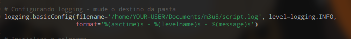
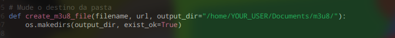
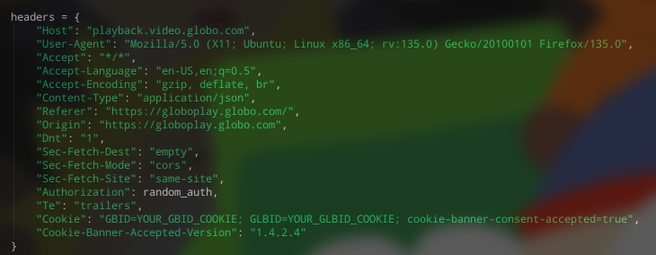
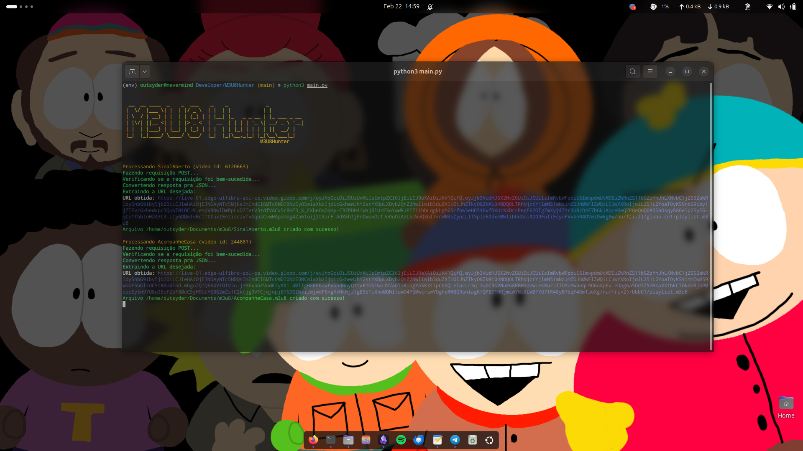

# Guia de Instalação do M3U8Hunter

---

## Pré-requisitos
- Python 3.6 ou superior instalado no seu sistema.
- pip (gerenciador de pacotes do Python) instalado. Ele geralmente vem com o Python, mas você pode verificar rodando "pip --version" no terminal ou prompt de comando.

Passos para Instalação

1. Configurar um Ambiente Virtual (Opcional, mas Recomendado)
   - Crie um ambiente virtual para manter as dependências isoladas:
     ```
     python -m venv env
     ```
     
   - Ative o ambiente:
     - No Windows: 
		```powershell
		.\env\Scripts\activate
		```
     - No Linux/macOS: 
		```sh
		source ./env/bin/activate
		```
   - Você verá "(env)" no prompt do terminal quando ativado.

2. Instalar as Dependências
   - Com o terminal na mesma pasta que o "requirements.txt", execute:
     ```
     pip install -r requirements.txt
     ```

3. Configurações adicionais:
	- Trocar diretorio de onde os arquivos vão ser salvos:
	  
	  
	
	- Trocar os Cookies:
	  ```
	  GBID=YOUR_GBID_TOKEN
	  GLBID=YOUR_GLBID_TOKEN
	  ``` 
	  
Executando o Programa
```sh
python3 main.py
```
   
   
Output esperado se tudo estiver correto:


---

obs.: Para pegar canais fechados como BBB, é preciso que sua conta tenha permissão pra acessar a mesma, caso contrario, uma conta gratuita so terá acesso a transmissão aberta! Programa criado visando Provedoras de Internet com serviços de televisão que precisam do link .m3u8 da globo já que eles alteram o link em determinado tempo. Adicionar o Script na Crontab

--- 
### Aviso importante! **Não apoio nenhum tipo de pirataria** e **não me responsabilizo pelo uso indevido deste código**. Este programa **não foi desenvolvido para burlar sistemas de pagamento ou para acessar conteúdo de maneira ilegal**. **Reforço que é de extrema importância respeitar os direitos autorais e os termos de serviço das plataformas de streaming**.

